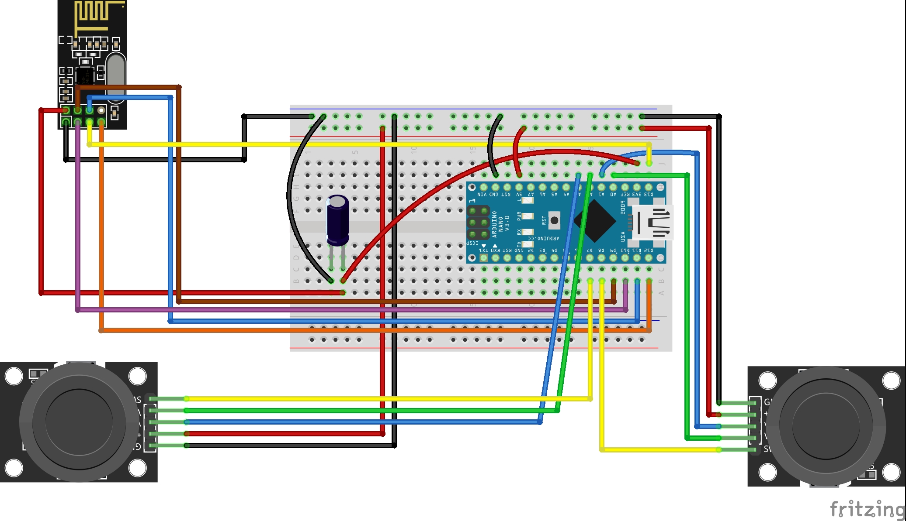

# Omnibot Domino Stacker

A modification for the **CrunchLabs Hack Pack Omnibot Forklift** that allows the robot to pick up and stack dominoes.

The project replaces the standard remote-control setup with an **Arduino-based wireless controller** using two joysticks. This allows for **variable-speed movement and rotation**, giving much finer control when positioning the robot and stacking dominoes.


## Features

* Wireless control using **NRF24L01** transceiver modules
* Arduino-based remote controller
* Dual joystick control
* Variable-speed forward/reverse/left/right movement
* Variable-speed rotation
* Servo-controlled domino stacking mechanism
* 3D-printed modifications and components

## Parts

### Robot

* **CrunchLabs Hack Pack Omnibot Forklift**
* 1 × Standard **SG90 Micro Servo**
* 1 × NRF24L01 Transceiver Module
* 1 × Decoupling capacitor (10 µF–100 µF recommended)
* Counterweight material (I used large bolts)
* Wires
* Access to a 3D printer

### Remote Control

* Arduino Nano
* 1 × NRF24L01 Transceiver Module
* 1 × Decoupling capacitor (10 µF–100 µF recommended)
* 2 × Joysticks (KY-023 or similar)
* Wires


### NRF24L01 Modules

[NRF24L01 Transceiver Modules on Amazon](https://www.amazon.com/dp/B00LX47OCY/ref=as_li_tl?ie=UTF8&tag=tyche-8392-20&psc=1)

The decoupling capacitors are used to help provide stable power to the NRF24L01 modules.

[100 µF Electrolytic Capacitors – SparkFun](https://www.sparkfun.com/electrolytic-decoupling-capacitors-100uf-25v.html)

## Arduino Libraries

The project uses the following Arduino libraries:

* **RF24** by TMRh20
  Install through the Arduino Library Manager or from the [RF24 GitHub repository](https://github.com/tmrh20/RF24/)

* **MapFloat** by radishlogic
  [MapFloat GitHub repository](https://github.com/radishlogic/MapFloat)

* **OneButton** by Matthias Hertel
  Install through the Arduino Library Manager or from the [OneButton GitHub repository](https://github.com/mathertel/OneButton)

* **hd44780** by Bill Perry
  Install through the Arduino Library Manager or from the [hd44780 GitHub repository](https://github.com/duinoWitchery/hd44780)

* **EasyJoystick** by Seth Kinzel
  [EasyJoystick GitHub repository](https://github.com/SethKinzel/EasyJoystick)

## Getting Started

### 1. Assemble the Omnibot modification

Install the 3D-printed parts and servo onto the Omnibot Forklift according to the build instructions.

> **Build instructions and 3D-print files:**
> Add links to the relevant STL files and assembly instructions here.

### 2. Build the remote controller

Follow the wiring diagram:



### 3. Install the required libraries

Install all of the libraries listed above using the Arduino Library Manager or their respective GitHub repositories.

### 4. Upload the Arduino sketches

Upload `Omnibot_Domino_Stacker.ino` to the Omnibot, and `OmniRemote_Transmitter.ino` to the remote control

### 5. Power on and connect

Turn on the Omnibot and remote controller. The NRF24L01 modules should establish a wireless connection, allowing the robot to be controlled using the joysticks.

## Controls

> **TODO:** Add a description of the joystick controls here.

For example:

| Control                   | Function                          |
| ------------------------- | --------------------------------- |
| Left joystick             | Movement                          |
| Right joystick left/right | Rotation                          |
| Right joystick up/down    | raise/lower dominoes              |
| Right joystick button     | Drop Dominoes/reset domino holder |

## 3D-Printed Parts

The project requires access to a 3D printer for the custom parts used by the domino-stacking mechanism.

> **TODO:** Add STL files and links to the individual parts here.

Recommended information for each part:

* Part name
* Quantity required
* Recommended print settings
* Any hardware required for assembly

## NRF24L01 Information

The NRF24L01 is used for wireless communication between the remote controller and the Omnibot.

This tutorial provides additional information about using the NRF24L01 with Arduino:

[NRF24L01 Arduino Wireless Communication Tutorial](https://www.instructables.com/NRF24L01-Tutorial-Arduino-Wireless-Communication/)


## Optional Components

The following components are **completely optional** and are disabled by default. They do not affect the basic operation of the robot.

### LCD

I had an i2c LCD (from the label maker hack pack) already attached to the Arduino I used for the remote control, so I added support for it. It simply displays **"Remote Control"**.

You do not need an LCD to use the project.

The LCD can be enabled or disabled by editing the following line in `OmniRemote_Transmitter.ino`:

```cpp
#define USE_LCD 0
```

Set this to `1` to enable the LCD:

```cpp
#define USE_LCD 1
```
hd44780 library by Bill Perry — required only when USE_LCD is set to 1  
Install through the Arduino Library Manager or from the [hd44780 GitHub repository](https://github.com/duinoWitchery/hd44780)  
If you are not using an LCD, you **do not need to install the hd44780 library**.

### LED Strip

There is also an optional LED strip (taken from the sand garden hack pack) that displays a simple color pattern. The LEDs are purely decorative and are not required for controlling the robot.

LED support can be enabled by uncommenting this line in `OmniRemote_Config.h`:

```cpp
#define USELEDS
```

When LED support is not needed, leave the line commented out:

If `USELEDS` is not defined, you **do not need to install the LED library**.


## Project Status

This project is a personal modification of the CrunchLabs Hack Pack Omnibot Forklift.

The repository contains the hardware modifications, Arduino code, and 3D-printed parts needed to build the domino stacker.

## Credits

* **CrunchLabs** – Omnibot Hack Pack Forklift
* **TMRh20** – RF24 library
* **radishlogic** – MapFloat library
* **Matthias Hertel** – OneButton library
* **Bill Perry** – hd44780 library
* **Seth Kinzel** – EasyJoystick library

## License

> **TODO:** Add the license for the code and 3D-print files here.
