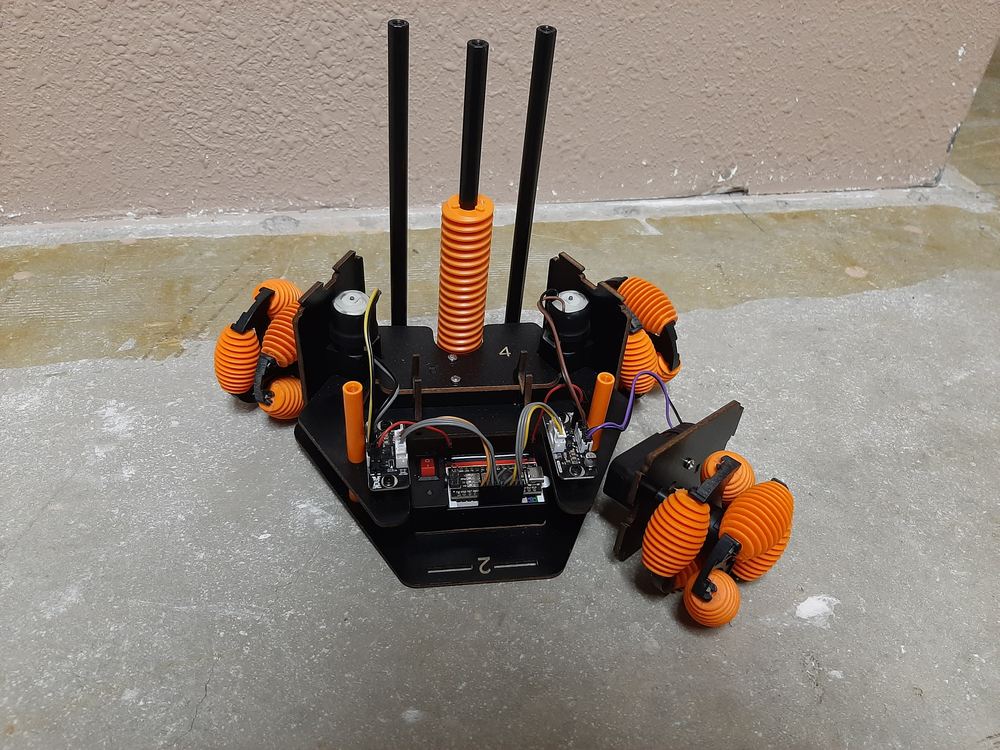
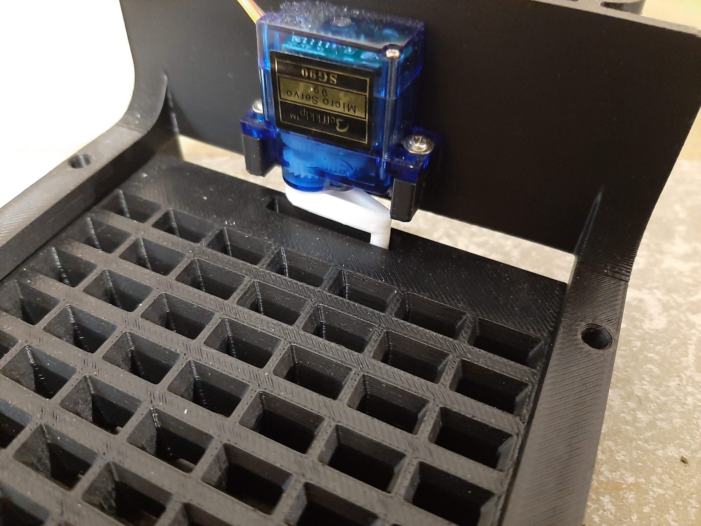
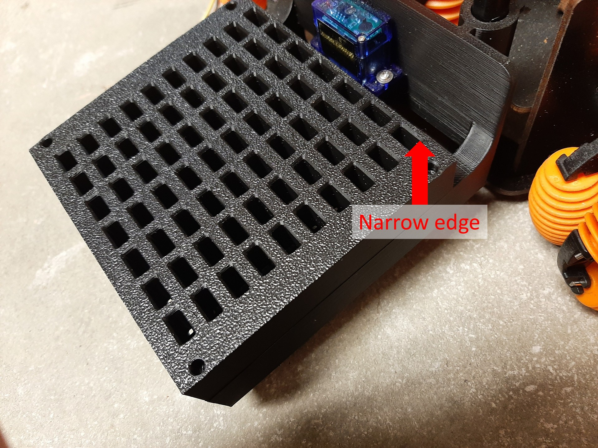
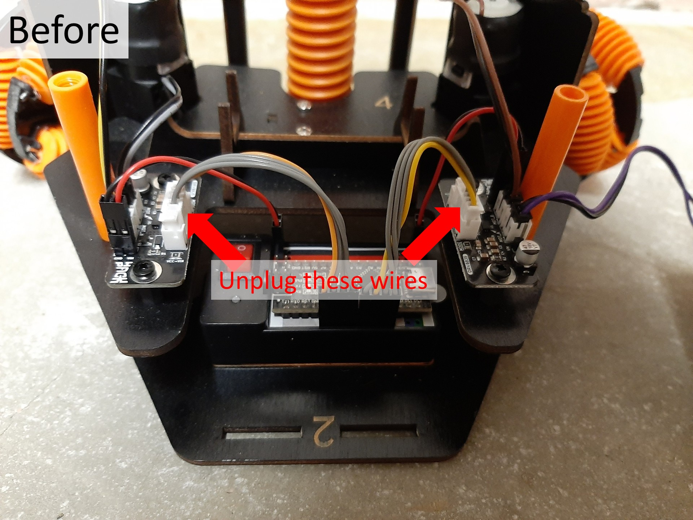
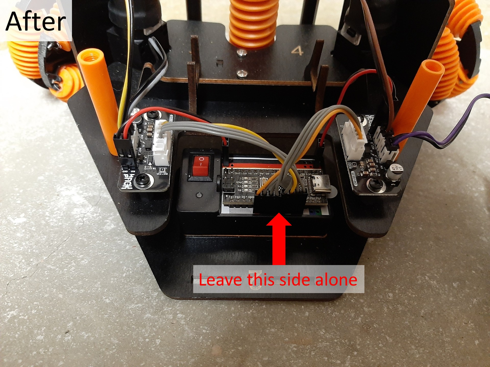
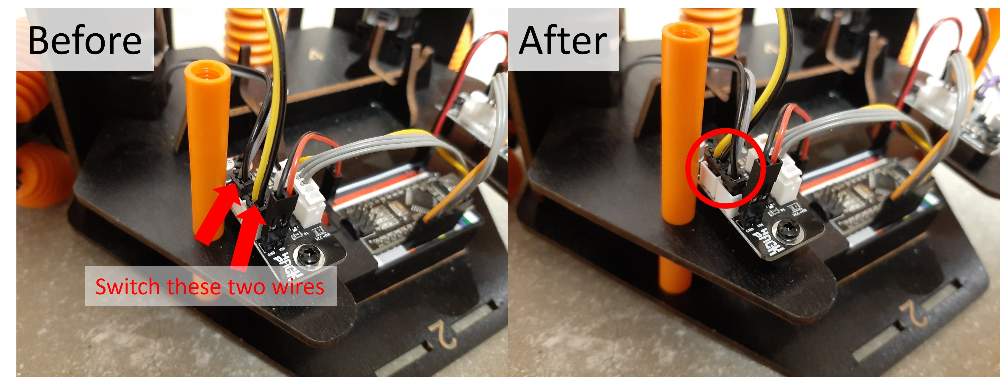
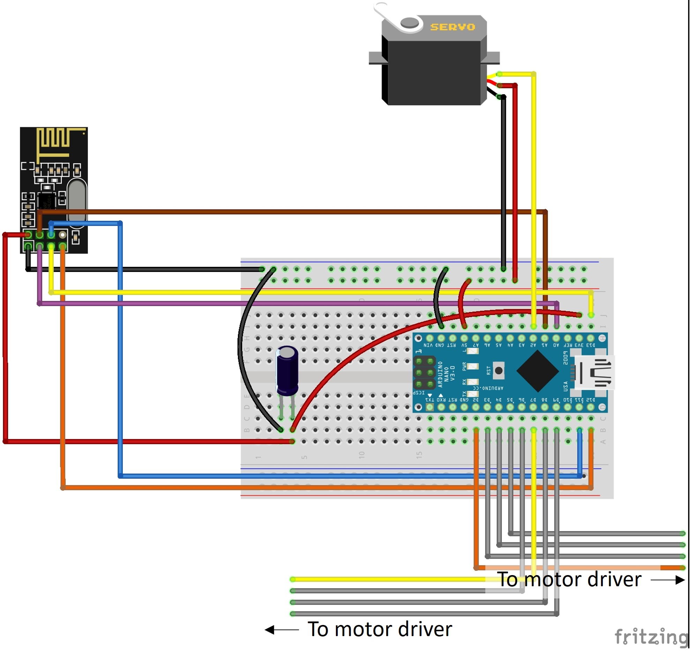

# Omnibot Domino Stacker

A modification for the **CrunchLabs Hack Pack Omnibot Forklift** that allows the robot to pick up and stack dominoes.

The project replaces the standard remote-control setup with an **Arduino-based wireless controller** using two joysticks. This allows for **variable-speed movement and rotation**, giving much finer control when positioning the robot and stacking dominoes.


## Features

* Wireless control using **NRF24L01** transceiver modules
* Arduino-based remote controller
* Dual joystick control
* Variable-speed forward/reverse/left/right movement
* Variable-speed rotation
* Servo-controlled domino stacking mechanism
* 3D-printed modifications and components

## Parts

### Robot

* **CrunchLabs Hack Pack Omnibot Forklift**
* 1 × Standard **SG90 Micro Servo**
* 1 × NRF24L01 Transceiver Module
* 1 × Decoupling capacitor (10 µF–100 µF recommended)
* Counterweight material (I used large bolts)
* Wires
* Access to a 3D printer

### Remote Control

* Arduino Nano
* 1 × NRF24L01 Transceiver Module
* 1 × Decoupling capacitor (10 µF–100 µF recommended)
* 2 × Joysticks (KY-023 or similar)
* Wires


### NRF24L01 Modules

[NRF24L01 Transceiver Modules on Amazon](https://www.amazon.com/dp/B00LX47OCY/ref=as_li_tl?ie=UTF8&tag=tyche-8392-20&psc=1)

The decoupling capacitors are used to help provide stable power to the NRF24L01 modules.

[100 µF Electrolytic Capacitors – SparkFun](https://www.sparkfun.com/electrolytic-decoupling-capacitors-100uf-25v.html)

This tutorial provides additional information about using the NRF24L01 with Arduino:

[NRF24L01 Arduino Wireless Communication Tutorial](https://www.instructables.com/NRF24L01-Tutorial-Arduino-Wireless-Communication/)


## Arduino Libraries

The project uses the following Arduino libraries:

* **RF24** by TMRh20
  Install through the Arduino Library Manager or from the [RF24 GitHub repository](https://github.com/tmrh20/RF24/)

* **MapFloat** by radishlogic
  [MapFloat GitHub repository](https://github.com/radishlogic/MapFloat)

* **OneButton** by Matthias Hertel
  Install through the Arduino Library Manager or from the [OneButton GitHub repository](https://github.com/mathertel/OneButton)

* **hd44780** by Bill Perry
  Install through the Arduino Library Manager or from the [hd44780 GitHub repository](https://github.com/duinoWitchery/hd44780)

* **EasyJoystick** by Seth Kinzel
  [EasyJoystick GitHub repository](https://github.com/SethKinzel/EasyJoystick)

## Getting Started

### 1. Remove Parts for Installation and Rewiring

Start by removing the parts of the Omnibot that need to be taken off to install the new **lift/domino stacker assembly**.

Removing these parts also gives you better access to the electronics and wiring, which you will need for the rewiring steps that follow.



### 2. Print the 3D Parts

Print the following files from the `3D` folder:
* Main Body.stl
* Slider.stl
* `DOMNO_Servo_Horn.stl` from the line following domino robot (2nd hackpack). I have included it here.
* Domino.stl  
I had success printing these standing upright with a small brim, but there might be other ways to do it.
Do a few small batches first, and make sure that they stand up and don't get caught.
Be sure to use enough elephant foot compensation.  
The robot takes 70 dominoes, but it might be good to have a few extra.

* (optional) Magazine.stl  
Allows the robot to stack multiple tiles of dominoes without reloading.  
You can stack multiple magazines on top of each other, until it gets too heavy.  
Print upside down, and be sure to block support from the holes in the four corners.

* (optional) folder `3D/Different size dominoes`


### 3. Install the new lift/domino mechanism

Assemble as shown:



If using the magazine, put the side with the narrow border towards the robot.



### 4. Rewire the Omnibot


* Swap ribbon cables

  The Domino Stacker uses a servo, which occupies one of the Arduino's hardware timer outputs. The stock Omnibot wiring uses PWM on pin 9, which conflicts with the servo.

  To avoid changing the existing ribbon cables, the motor assignments are rearranged so that the three drive motors use PWM-capable pins while the lift motor (which only needs full-speed up/down movement) uses the remaining output.

  The Omnibot has two ribbon cables connecting the Arduino board to the motor driver boards.

  **Swap the two ribbon cables on the motor driver boards only.**

  > **Important:** Leave the Arduino ends plugged in exactly as they are. Only unplug and swap the ends connected to the two motor driver boards.

  
  
  

* Swap yellow/gray motor cables

  On the **left motor driver board**, swap these two cables:

  * Yellow cable from **Motor 1**
  * Gray cable from the **Lift Motor**

  After swapping them, the motor connections should match the new pin assignments used by the software.

  

* Add the Receiver and Servo

  Once the rewiring is complete, add the **receiver** and the **servo** according to the wiring diagram.

  Make sure all connections match the diagram before powering on the robot.

  #### ⚠️ Warning – NRF24L01 Power

  The **NRF24L01 requires 3.3V**. Connect VCC to the Arduino's **3.3V pin, NOT 5V**.

  I connected both the transceiver and capacitor to the 3.3V pin on the Arduino using a simple Y-shaped wire made by soldering **one male wire to two female wires**.

  

### 5. Add Counterweight

Reassemble the robot and install a counterweight at the back. The counterweight helps maintain enough friction on the back wheel.

### 6. Build the remote controller

Follow the wiring diagram:

#### ⚠️ Warning – NRF24L01 Power

The **NRF24L01 requires 3.3V**. Connect VCC to the Arduino's **3.3V pin, NOT 5V**.


### 7. Install the required libraries

Install all of the libraries listed above using the Arduino Library Manager or their respective GitHub repositories.

### 8. Upload the Arduino sketches

Upload `Omnibot_Domino_Stacker.ino` to the Omnibot, and `OmniRemote_Transmitter.ino` to the remote control.

### 9. Power on and connect

Turn on the Omnibot and remote controller. The NRF24L01 modules should establish a wireless connection, allowing the robot to be controlled using the joysticks.

## Controls

| Control                   | Function                            |
| ------------------------- | ----------------------------------- |
| Left joystick             | Movement                            |
| Right joystick left/right | Rotation                            |
| Right joystick up/down    | Raise/lower dominoes                |
| Right joystick button     | Drop dominoes / reset domino holder |

## Optional Components

The following components are **completely optional** and are disabled by default. They do not affect the basic operation of the robot.

### LCD

I had an I2C LCD (from the label maker Hack Pack) already attached to the Arduino I used for the remote control, so I added support for it. It simply displays **"Remote Control"**.

You do not need an LCD to use the project.

The LCD can be enabled or disabled by editing the following line in `OmniRemote_Transmitter.ino`:

```cpp
#define USE_LCD 0
```

Set this to `1` to enable the LCD:

```cpp
#define USE_LCD 1
```

Wire the I2C LCD to the I2C port on A4 and A5

hd44780 library by Bill Perry — required only when USE_LCD is set to 1  
Install through the Arduino Library Manager or from the [hd44780 GitHub repository](https://github.com/duinoWitchery/hd44780)

If you are not using an LCD, you **do not need to install the hd44780 library**.

### LED Strip

There is also an optional LED strip (taken from the sand garden Hack Pack) that displays a simple color pattern. The LEDs are purely decorative and are not required for controlling the robot.

LED support can be enabled by uncommenting this line in `OmniRemote_Config.h`:

```cpp
#define USELEDS
```

When LED support is not needed, leave the line commented out.

Wire the led strip to pin 2

FastLED library by Daniel Garcia - required only when USELEDS is defined.

If `USELEDS` is not defined, you **do not need to install the FastLED library**.

## Project Status

This project is a personal modification of the CrunchLabs Hack Pack Omnibot Forklift.

The repository contains the hardware modifications, Arduino code, and 3D-printed parts needed to build the domino stacker.

## Credits

* **CrunchLabs** – Omnibot Hack Pack Forklift
* **TMRh20** – RF24 library
* **radishlogic** – MapFloat library
* **Matthias Hertel** – OneButton library
* **Bill Perry** – hd44780 library
* **Seth Kinzel** – EasyJoystick library
